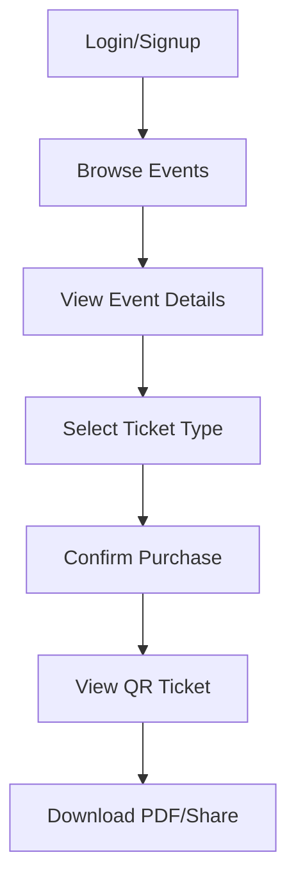
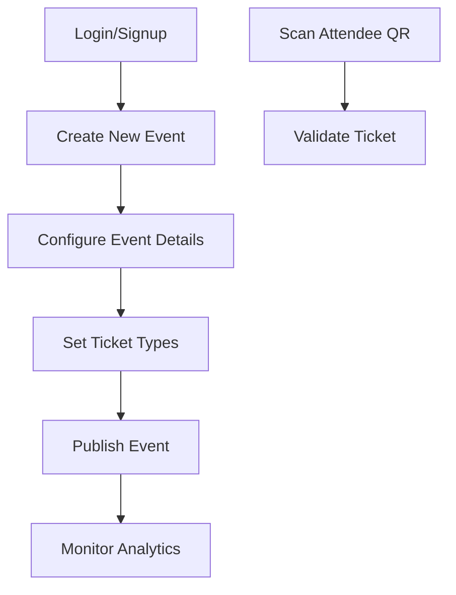

# ✨ TicketWave ✨
### The Ultimate Event Ticket Generator & Scanner App

<div align="center">
  
  

  
  <p align="center">
    <a href="#features">Features</a> •
    <a href="#app-screens">App Screens</a> •
    <a href="#tech-stack">Tech Stack</a> •
    <a href="#installation">Installation</a> •
    <a href="#user-flows">User Flows</a> •
    <a href="#roadmap">Roadmap</a>
  </p>
  
  
  
  
  
</div>

<br>

## 🚀 Introduction

**TicketWave** is a modern, feature-rich Kotlin application that revolutionizes how organizers create events and how attendees discover and participate in them. With beautiful Material You design, interactive QR tickets, and seamless scanning capabilities, TicketWave brings event management into the future.


## ✨ Features

### For Attendees
- 🔍 **Discover Events** - Browse and search upcoming events with intuitive filters
- 🎟️ **Interactive Tickets** - Receive beautiful, animated QR tickets for your events
- 📱 **Offline Access** - Download tickets as PDFs or save them to your device
- 🔔 **Smart Notifications** - Get timely reminders about your upcoming events

### For Organizers
- 🛠️ **Event Creation** - Design and publish events with rich details and imagery
- 🏷️ **Ticket Types** - Create multiple ticket categories (VIP, Regular, Early Bird)
- 📷 **QR Scanner** - Quick validation with real-time feedback and animations
- 📊 **Analytics Dashboard** - Track attendance and engagement with interactive charts


## 🧩 App Flow Animation

```
SplashScreen
    ↓ [fade transition]
LoginScreen ⟷ SignupScreen
    ↓ [slide transition]
HomeScreen (Bottom Navigation)
    ├── 🔍 Explore Tab
    │     ↓ [shared element]
    │   EventDetailsScreen
    │     ↓ [bottom sheet]
    │   RegisterForTicket → TicketPreviewScreen
    │
    ├── 🎟️ My Tickets Tab
    │     ↓ [tap animation]
    │   TicketDetailsScreen
    │
    ├── ➕ Create Tab (Organizers)
    │     ↓ [slide transition]
    │   EventCreationScreen → TicketTypeSetup
    │
    └── 👤 Profile Tab
          ↓ [fade transition]
        UserProfileScreen → Settings
```

## 🔧 Tech Stack

<table>
  <tr>
    <td align="center">
      <a href="https://kotlinlang.org/">
        <br>Kotlin
      </a>
    </td>
    <td align="center">
      <a href="https://developer.android.com/jetpack/compose">
        <br>Jetpack Compose
      </a>
    </td>
    <td align="center">
      <a href="https://m3.material.io/">
        <br>Material You
      </a>
    </td>
    <td align="center">
      <a href="https://firebase.google.com/">
        <br>Firebase
      </a>
    </td>
  </tr>
  <tr>
    <td align="center">
      <a href="https://developer.android.com/jetpack/androidx/releases/room">
        <br>Room DB
      </a>
    </td>
    <td align="center">
      <a href="https://airbnb.io/lottie/#/">
        <br>Lottie
      </a>
    </td>
    <td align="center">
      <a href="https://developer.android.com/training/camerax">
        <br>CameraX
      </a>
    </td>
    <td align="center">
      <a href="https://github.com/zxing/zxing">
        <br>ZXing
      </a>
    </td>
  </tr>
</table>


### Libraries & Tools

- 🏗️ **Architecture**: MVVM with Clean Architecture principles
- 🧵 **Concurrency**: Kotlin Coroutines & Flow
- 🗃️ **Local Storage**: Room Database
- ☁️ **Backend**: Firebase (Auth, Firestore, Storage, FCM)
- 📊 **Charts**: MPAndroidChart / Compose Charts
- 🎭 **Animations**: Lottie & Compose Animations
- 📷 **QR Scanning**: ZXing / ML Kit Barcode
- 📄 **PDF Export**: iText / Android PDF Document
- 🧭 **Navigation**: Jetpack Navigation Component
- 📱 **Camera**: CameraX
- 🔄 **Dependency Injection**: Hilt

## 🚀 Getting Started

### Prerequisites

- Android Studio Arctic Fox or newer
- Kotlin 1.8.0+
- Android SDK 21+
- JDK 11

### Installation

```bash
# Clone the repository
git clone https://github.com/Gerri254/EventTicketApp.git

# Navigate to the project directory
cd EventTicketApp

# Open with Android Studio and sync Gradle
```

### Setup Firebase

1. Create a Firebase project in the [Firebase Console](https://console.firebase.google.com/)
2. Add your Android app to the Firebase project
3. Download the `google-services.json` file
4. Place the file in the app module directory

## 🎬 User Flows

### Attendee Flow



### Organizer Flow



## 🌟 Key UI Features

- 🌙 **Dynamic Theming**: Adapts to device theme settings and user preferences
- 🔄 **Interactive Animations**: Lottie animations for key app moments
- 📱 **Responsive Design**: Adapts seamlessly to different screen sizes
- ♿ **Accessibility**: High contrast mode, screen reader support, text scaling
- 🔍 **Intuitive Search**: Rich filtering options with animated transitions
- 📊 **Interactive Analytics**: Animated charts and data visualization 

## 📅 Development Roadmap

### Phase 1: Core System (Weeks 1-2)
- [x] Project setup & architecture
- [x] UI/UX design system implementation
- [x] Firebase integration
- [x] Authentication flows

### Phase 2: Event & Ticket Flow (Weeks 3-4)
- [ ] Event creation & management
- [ ] Ticket type configuration
- [ ] QR code generation
- [ ] PDF export functionality

### Phase 3: Access & Scanning (Weeks 5-6)
- [ ] QR scanner implementation
- [ ] Ticket validation logic
- [ ] Offline capability
- [ ] User feedback animations

### Phase 4: Polish & Testing (Weeks 7-8)
- [ ] Performance optimization
- [ ] UI refinement
- [ ] User testing
- [ ] Bug fixes

## 🤝 Contributing

Contributions are welcome! Please feel free to submit a Pull Request.

1. Fork the repository
2. Create your feature branch (`git checkout -b feature/amazing-feature`)
3. Commit your changes (`git commit -m 'Add some amazing feature'`)
4. Push to the branch (`git push origin feature/amazing-feature`)
5. Open a Pull Request

## 📄 License

This project is licensed under the MIT License - see the [LICENSE](LICENSE) file for details.

## 🙏 Acknowledgements

- [Material Design 3](https://m3.material.io/)
- [Jetpack Compose](https://developer.android.com/jetpack/compose)
- [Firebase](https://firebase.google.com/)
- [Lottie Animations](https://airbnb.design/lottie/)
- [ZXing](https://github.com/zxing/zxing)

---

<p align="center">
  Made with ❤️ by Luzzi Geraldo
</p>

<p align="center">
  
</p>
